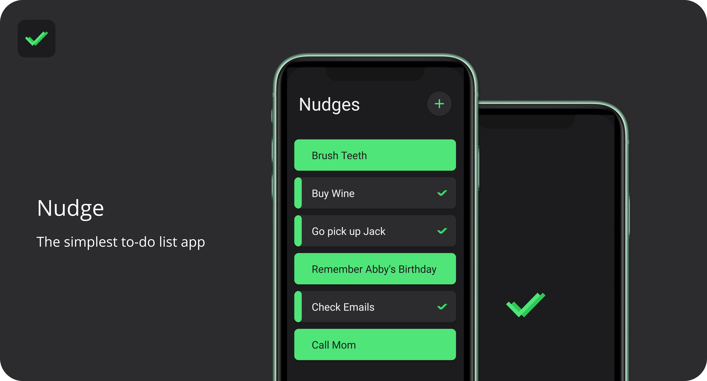
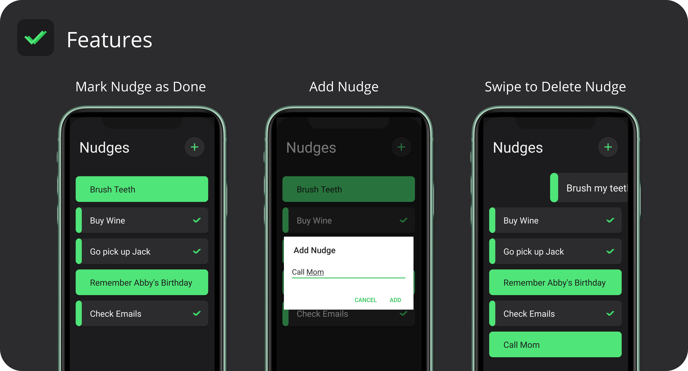

<!--Nudge README.MD-->
<!--
*** I'm using markdown "reference style" links for readability.
*** Reference links are enclosed in brackets [ ] instead of parentheses ( ).
*** See the bottom of this document for the declaration of the reference variables
-->
[![Contributors][contributors-shield]][contributors-url]
[![Forks][forks-shield]][forks-url]
[![Stargazers][stars-shield]][stars-url]
[![LinkedIn][linkedin-shield]][linkedin-url]

<!-- PROJECT LOGO -->
<br />
<p align="center">
  <a href="https://github.com/ArmandPretorius/nudge">
    
  </a>

  <h3 align="center">Nudge</h3>

  <p align="center">
    The simplest to-do list application for you to be more productive
    <br />
    <a href="https://github.com/ArmandPretorius/nudge"><strong>Explore the docs »</strong></a>
    <br />
    <br />
    <a href="https://github.com/ArmandPretorius/nudge">View Demo</a>
    ·
    <a href="https://github.com/ArmandPretorius/nudge/issues">Report Bug</a>
    ·
    <a href="https://github.com/ArmandPretorius/nudge/issues">Request Feature</a>
  </p>
</p>


<!-- TABLE OF CONTENTS -->
## Table of Contents

* [About the Project](#about-the-project)
  * [Built With](#built-with)
  * [Installation](#installation)
* [Features](#features)
* [Usage](#usage)
* [Logic](#logic)
* [Contribution](#contribution)
* [License](#license)
* [Challenges](#challenges)
* [Contact](#contact)

<!-- ABOUT THE PROJECT -->
## About The Project



Nudge is a Android to-do list application where you can create a simple list of anything you want to remember. Easily reorder the list, mark items as finished and delete items.

This Project is for my Term 3 elective, Native Android Development 303, for which we were tasked to create an application that can enhance productivity.

### Built With
This Android application was build using:
* [Kotlin](https://kotlin.com)
* [Android Studio](https://developer.android.com/studio)


### Installation

1. Download and Install Android Studio [https://developer.android.com/studio/](https://developer.android.com/studio/?gclid=Cj0KCQjwwb3rBRDrARIsALR3XebjEaQoXtWT6vLV1c43xpC1p29hG1Q-30M1OmJ87E6Qm4pCuy3yBU8aAqrgEALw_wcB)
2. Clone the repo
```sh
git clone https:://github.com/ArmandPretorius/nudge.git
```
3. Then open the project in Android Studio

## Features



<!-- USAGE -->
## Usage

When opening Nudge, you can click on the floating action button in the top-right corner to create a new nudge into the list. A dialog will pop-up in which you can add your text.

After you've created a nudge, you can click on it to mark it as finished or not.

When swiping left or right on the nudge to delete it.

If you have more than one nudge, you can long press on a nudge and drag it up and down to re-arange the list.

[View Demo]()
<!-- HOW DOES IT WORK -->
## Logic

The application uses [SQLite](https://www.sqlite.org/index.html) to store the items on the device and populates the information into a RecycleView.


<!-- Challenges Made -->
## Challenges

* I wanted to include a timer function where you can select how long you think each nudge would take, then when you click on a nudge, the timer will start and then tell you when the time is up.

* I also struggled with the swipe to delete functionality, so at the moment it isn't implemented.
* Also, I wanted to implement notifications, which shows you how many nudges you have left.
* I'd also like to add a indication that there are no nudges.

<!-- CONTRIBUTING -->
## Contributing

Contributions are what make the open source community such an amazing place to be learn, inspire, and create. Any contributions you make are **greatly appreciated**.

1. Fork the Project
2. Create your Feature Branch (`git checkout -b feature/YourAmazingFeature`)
3. Commit your Changes (`git commit -m 'Add some AmazingFeature'`)
4. Push to the Branch (`git push origin feature/YourAmazingFeature`)
5. Open a Pull Request


<!-- LICENSE -->
## License

Distributed under the MIT License. See `LICENSE` for more information.


<!-- CONTACT -->
## Contact

Armand Pretorius - [@amplified_designs](https://www.instagram.com/amplified_designs/) - 170045@virtualwindow.co.za

Project Link: [https://github.com/ArmandPretorius/nudge](https://github.com/ArmandPretorius/nudge)


<!-- MARKDOWN LINKS & IMAGES -->
[product-screenshot]: nudge_screenshot.png
[contributors-shield]: https://img.shields.io/github/contributors/ArmandPretorius/nudge.svg?style=flat-square
[contributors-url]: https://github.com/ArmandPretorius/nudge/graphs/contributors
[forks-shield]: https://img.shields.io/github/forks/ArmandPretorius/nudge.svg?style=flat-square
[forks-url]: https://github.com/ArmandPretorius/nudge/network/members
[stars-shield]: https://img.shields.io/github/stars/ArmandPretorius/nudge.svg?style=flat-square
[stars-url]: https://github.com/ArmandPretorius/nudge/stargazers
[issues-shield]: https://img.shields.io/github/issues/ArmandPretorius/nudge.svg?style=flat-square
[issues-url]: https://github.com/ArmandPretorius/nudge/issues
[license-shield]: https://img.shields.io/github/license/ArmandPretorius/nudge.svg?style=flat-square
[license-url]: https://github.com/ArmandPretorius/nudge/master/LICENSE.txt
[linkedin-shield]: https://img.shields.io/badge/-LinkedIn-black.svg?style=flat-square&logo=linkedin&colorB=555
[linkedin-url]: https://www.linkedin.com/in/armand-pretorius-293b3a18a
